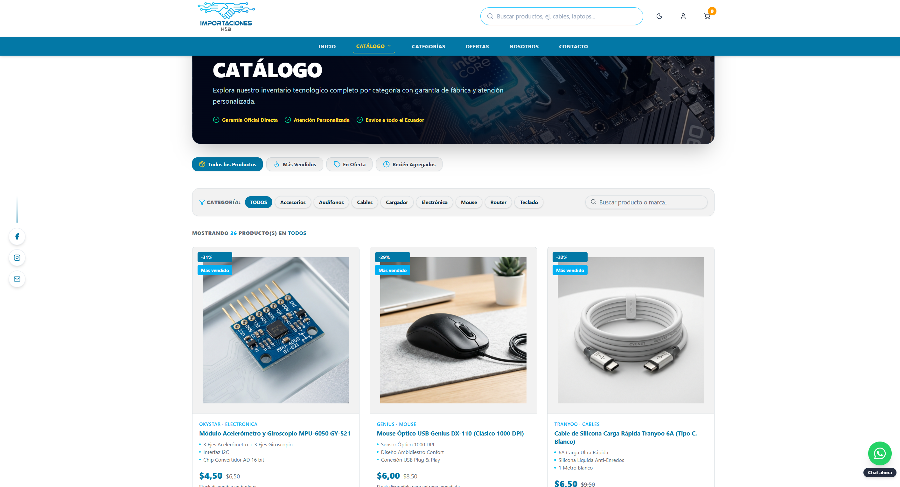
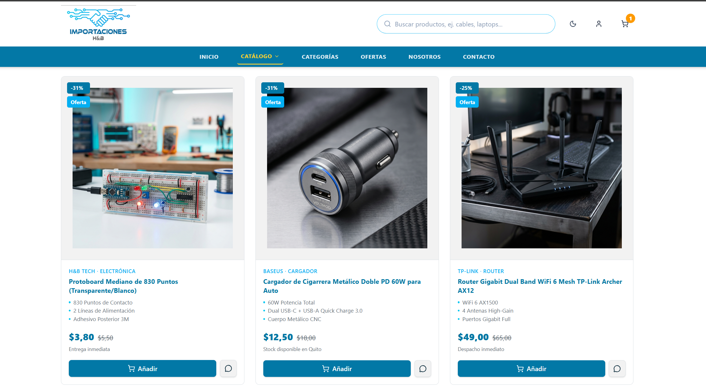
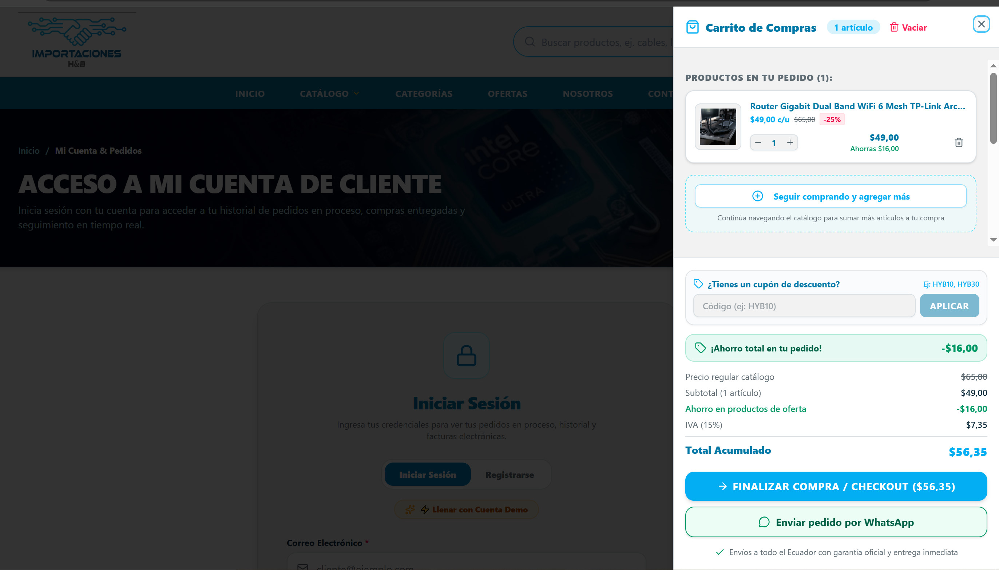
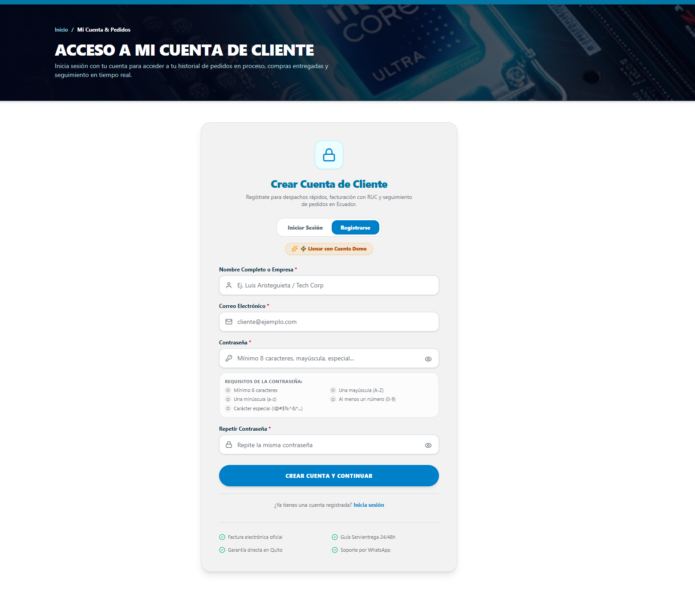

# ⚡ Importaciones H&B - E-Commerce & Tech Showcase

> 🎓 **Nota Académica / Educativa:** Este proyecto ha sido desarrollado exclusivamente con **fines educativos y demostrativos** para proyectos de desarrollo de software académico. Las marcas, nombres y productos presentados se utilizan a modo de prototipo interactivo para simular el funcionamiento real de una plataforma de comercio electrónico.

---

Plataforma web e-commerce interactiva desarrollada como prototipo para **Importaciones H&B**, orientada a la venta y distribución de componentes electrónicos, módulos, sensores y robótica.

El sistema ofrece una experiencia de compra moderna, dinámica y segura, integrando herramientas de contacto directo, validación de datos en compras y promociones dinámicas.

---

## 🚀 Novedades y Funcionalidades Recientes

* **📱 Canales de Contacto Flotantes:** Integración de botones flotantes interactivos de redes sociales y atención inmediata vía WhatsApp para soporte directo al cliente.
* **🔒 Validaciones en Registro y Facturación:** Validación en tiempo real para cajas de texto en los formularios de creación de cliente y emisión de datos de facturación (previniendo errores en campos de identificación, correos y dirección).
* **🎟️ Sistema de Códigos Promocionales:** Módulo en el carrito de compras que permite ingresar cupones de descuento, aplicando y reflejando la rebaja automáticamente en el desglose final del pedido.

---

## ✨ Características Principales

* **Landing Page & Hero Slider:** Banner principal panorámico e interactivo con promociones y llamados a la acción (CTA).
* **Catálogo de Productos & Filtros:** Exploración de componentes por categorías (robótica, sensores, módulos, etc.) con búsqueda en tiempo real.
* **Carrito de Compras & Cotizaciones:** Cálculo transparente de costos, cupones de descuento y carrito interactivo.
* **Módulo de Facturación & Datos de Cliente:** Proceso de checkout optimizado con validación rigurosa de entradas.
* **Panel de Navegación SPA:** Transiciones instantáneas entre secciones (`/`, `/catalogo`, `/login`, etc.) mediante React Router.

---

## 🛠️ Tecnologías Utilizadas

* **Frontend:** React, Tailwind CSS, Vite.
* **Enrutamiento:** React Router (Single Page Application).
* **Iconos & UI:** Lucide React / FontAwesome, componentes estilizados.
* **Control de Versiones:** Git / GitHub (`h-b-tech-showcase`).

---

## 📦 Instalación y Configuración Local

Sigue estos pasos para ejecutar la aplicación en tu entorno local:

### 1. Clonar el repositorio
```bash
git clone https://github.com/luisAristeguieta/h-b-tech-showcase.git
cd h-b-tech-showcase

## 💻 Vista General y Comercio
| Página de Inicio (Landing) | Catálogo de Productos |
| :---: | :---: |
|  |  |

### 🛒 Detalle y Proceso de Compra
| Detalle del Producto | Carrito de Compras |
| :---: | :---: |
|  |  |

### 🔐 Vista de Cliente / Usuario:
| Vista de Cliente |
| :---: |
|  |